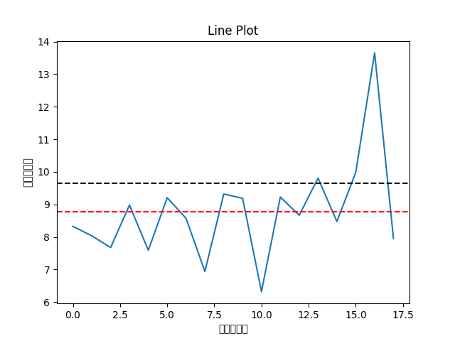

# Fuel-consumption-per-tonne-of-refuse
A data analysis project on real-world cars fuel consumption per tonne of refuse. The intention is to find any abnormal fuel consumption thus reporting potential illegal fuel trading.

# How to use
This project use a simple graphical interface built with Python's tkinter, the program reads an Excel file containing detailed fueling records, extracts and cleans the data, and segregates it by individual vehicle based on license plates. For each car, it calculates the fuel consumption per 100 kilometers, computes key statistics like maximum, minimum, average, and variance, and flags abnormal consumption events that exceed a preset threshold. Additionally, the project generates line plots that visually depict the consumption trends over time, saving these graphs for further analysis. This tool streamlines the process of monitoring vehicle performance, helping detect irregular fuel usage early on.

# Result
The are three kinds of lines in a visualization pic. The blue line shows trend of the amount of fuel used in one round with time. The red line shows the average fuel consumption, while the black line is 1.1x the value of red line, representing the boundary of normal records and abnormal records.

